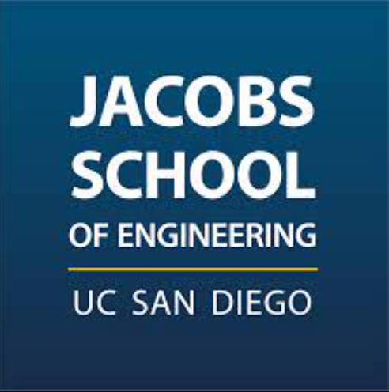
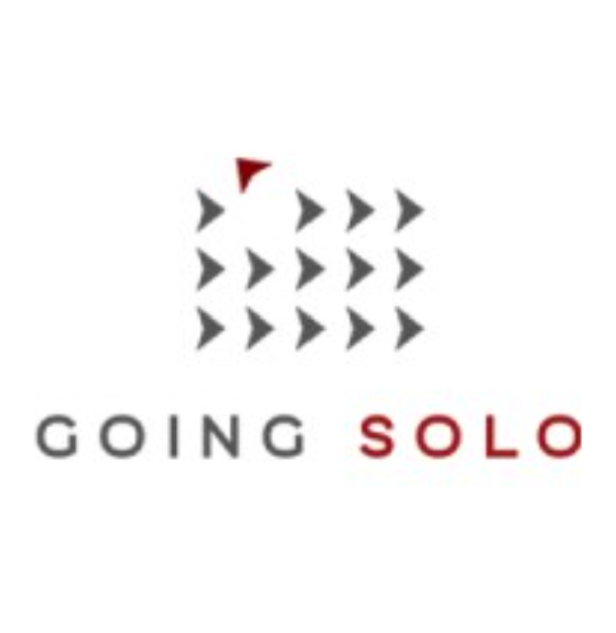
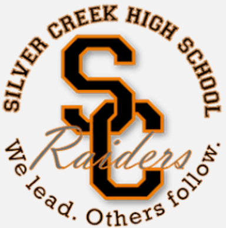

<em>"Links to disclosable code, presentations, and deliverables are available on my LinkedIn profile"</em>

 

 
  
  
<strong> Fellow Scholar
  &nbsp;&nbsp;&nbsp;&nbsp;&nbsp;&nbsp;&nbsp;&nbsp;&nbsp;&nbsp;&nbsp;&nbsp;&nbsp;&nbsp;&nbsp;&nbsp;&nbsp;&nbsp;&nbsp;&nbsp;&nbsp;&nbsp;&nbsp;&nbsp;&nbsp;&nbsp;&nbsp;&nbsp;&nbsp;&nbsp;&nbsp;&nbsp;&nbsp;&nbsp;&nbsp;&nbsp;&nbsp;&nbsp;&nbsp;&nbsp;&nbsp;&nbsp;&nbsp;&nbsp;&nbsp;&nbsp;&nbsp;&nbsp;&nbsp;&nbsp;&nbsp;&nbsp;&nbsp;&nbsp;&nbsp;&nbsp;&nbsp;&nbsp;&nbsp;&nbsp;&nbsp;&nbsp;&nbsp;&nbsp;&nbsp;&nbsp;&nbsp;&nbsp;&nbsp;&nbsp;&nbsp;&nbsp;&nbsp;&nbsp;&nbsp;&nbsp;&nbsp;&nbsp;
  Sep 2023 - Present</strong><em> La Jolla, California
  &nbsp;&nbsp;&nbsp;&nbsp;&nbsp;&nbsp;&nbsp;&nbsp;&nbsp;&nbsp;&nbsp;&nbsp;&nbsp;&nbsp;&nbsp;&nbsp;&nbsp;&nbsp;&nbsp;&nbsp;&nbsp;&nbsp;&nbsp;&nbsp;&nbsp;&nbsp;&nbsp;&nbsp;&nbsp;&nbsp;&nbsp;&nbsp;&nbsp;&nbsp;&nbsp;&nbsp;&nbsp;&nbsp;&nbsp;&nbsp;&nbsp;&nbsp;&nbsp;&nbsp;&nbsp;&nbsp;&nbsp;&nbsp;&nbsp;&nbsp;&nbsp;&nbsp;&nbsp;&nbsp;&nbsp;&nbsp;&nbsp;&nbsp;&nbsp;&nbsp;&nbsp;&nbsp;&nbsp;&nbsp;&nbsp;&nbsp;&nbsp;&nbsp;&nbsp;&nbsp;&nbsp;&nbsp;&nbsp;&nbsp;&nbsp;&nbsp;&nbsp;&nbsp;&nbsp;&nbsp;&nbsp;&nbsp;&nbsp;&nbsp;&nbsp;&nbsp;&nbsp;&nbsp;&nbsp;
  Fellowship</em>

Real Estate + Data Science experiential learning fellowship with the Urban Studies & Planning Department and Homelessness Hub at UC San Diego, under the ULI H2H Mission Priority Initiative.

<b>Affordable Housing Assistant Research Fellow</b>

Mentors: [Dr. Feiyang Sun](https://usp.ucsd.edu/people/faculty/profiles/sun-feiyang.html), [Dr. Mirle Rabinowitz-Bussell](https://usp.ucsd.edu/people/faculty/profiles/rabinowitz-bussell.html)
 
- Identify and report policy incentives and cost factors relevant to the site context, opportunities, and constraints of affordable housing projects across the United States
- Attend meetings and events with industry professionals at the Urban Land Institute to learn practical insights into the current market feasibility of affordable housing projects, with emphasis on LIHTC and ADUs
- Received departmental sponsorship to get involved and network with the San Diego Green Building Council to study state-of-the-art green building techniques and ways to integrate green building with affordable housing

<b>Data Science Fellow</b>

- Identified data sources across the local, city, and county levels for further analytical purposes, domains include land use, utilities, parking, transit networks, historical districts, balanced community development areas (TIF, CDBG, CIP), public health, and project-level public data
- Conducted a literature review of basic to novel technical real estate data science applications, ranging from hedonic price models to neural networks
- Developed a data processing script to retrieve and parse property data from CoStar into a tabular format for machine learning research purposes

 

 
  
  
<strong> President & Data Analyst
  &nbsp;&nbsp;&nbsp;&nbsp;&nbsp;&nbsp;&nbsp;&nbsp;&nbsp;&nbsp;&nbsp;&nbsp;&nbsp;&nbsp;&nbsp;&nbsp;&nbsp;&nbsp;&nbsp;&nbsp;&nbsp;&nbsp;&nbsp;&nbsp;&nbsp;&nbsp;&nbsp;&nbsp;&nbsp;&nbsp;&nbsp;&nbsp;&nbsp;&nbsp;&nbsp;&nbsp;&nbsp;&nbsp;&nbsp;&nbsp;&nbsp;&nbsp;&nbsp;&nbsp;&nbsp;&nbsp;&nbsp;&nbsp;&nbsp;&nbsp;&nbsp;&nbsp;&nbsp;&nbsp;&nbsp;&nbsp;
  Sep 2022 - Present</strong><em> La Jolla, California
  &nbsp;&nbsp;&nbsp;&nbsp;&nbsp;&nbsp;&nbsp;&nbsp;&nbsp;&nbsp;&nbsp;&nbsp;&nbsp;&nbsp;&nbsp;&nbsp;&nbsp;&nbsp;&nbsp;&nbsp;&nbsp;&nbsp;&nbsp;&nbsp;&nbsp;&nbsp;&nbsp;&nbsp;&nbsp;&nbsp;&nbsp;&nbsp;&nbsp;&nbsp;&nbsp;&nbsp;&nbsp;&nbsp;&nbsp;&nbsp;&nbsp;&nbsp;&nbsp;&nbsp;&nbsp;&nbsp;&nbsp;&nbsp;&nbsp;&nbsp;&nbsp;&nbsp;&nbsp;&nbsp;&nbsp;&nbsp;&nbsp;&nbsp;&nbsp;&nbsp;&nbsp;&nbsp;&nbsp;&nbsp;&nbsp;&nbsp;&nbsp;&nbsp;&nbsp;&nbsp;&nbsp;&nbsp;&nbsp;&nbsp;&nbsp;&nbsp;&nbsp;&nbsp;&nbsp;&nbsp;&nbsp;&nbsp;&nbsp;&nbsp;&nbsp;&nbsp;&nbsp;
  Part-time</em>

Organization website: [Biokind Analytics](https://www.biokind.org/)

- Manage organizational leadership, budget, marketing, outreach, and recruitment activities
- Collaborate with local healthcare non-profits throughout San Diego to discuss potential avenues for data science to improve insights generation, operational efficiency, impact, outreach, client satisfaction, return on investment, and data systems and use case designs
- Oversee and participate in student data science projects to ensure quality, timely delivery, and meeting clients' expectations; facilitating opportunities for students to apply academic training in impactful, real-world scenarios
- Collaborate with clients to analyze complex operational/financial datasets in identifying key metrics and actionable insights, leading to improved client understanding of programs, initiatives, research grants performance, and furthered clients mission as data-driven organizations
- Organize discussions and meetings with university teaching faculty, department advisors, and non-profit representatives
- Communicate opportunities in public health and data science, including informational and engagement events, to chapter members

 

 
  
  
<strong> Data Science Trainee in Niema Lab
  &nbsp;&nbsp;&nbsp;&nbsp;&nbsp;&nbsp;&nbsp;&nbsp;&nbsp;&nbsp;&nbsp;&nbsp;&nbsp;&nbsp;&nbsp;&nbsp;&nbsp;&nbsp;&nbsp;&nbsp;&nbsp;&nbsp;&nbsp;&nbsp;&nbsp;&nbsp;&nbsp;&nbsp;&nbsp;&nbsp;&nbsp;&nbsp;&nbsp;&nbsp;&nbsp;&nbsp;&nbsp;&nbsp;&nbsp;&nbsp;&nbsp;
  Sep 2022 - Oct 2023</strong><em> La Jolla, California
  &nbsp;&nbsp;&nbsp;&nbsp;&nbsp;&nbsp;&nbsp;&nbsp;&nbsp;&nbsp;&nbsp;&nbsp;&nbsp;&nbsp;&nbsp;&nbsp;&nbsp;&nbsp;&nbsp;&nbsp;&nbsp;&nbsp;&nbsp;&nbsp;&nbsp;&nbsp;&nbsp;&nbsp;&nbsp;&nbsp;&nbsp;&nbsp;&nbsp;&nbsp;&nbsp;&nbsp;&nbsp;&nbsp;&nbsp;&nbsp;&nbsp;&nbsp;&nbsp;&nbsp;&nbsp;&nbsp;&nbsp;&nbsp;&nbsp;&nbsp;&nbsp;&nbsp;&nbsp;&nbsp;&nbsp;&nbsp;&nbsp;&nbsp;&nbsp;&nbsp;&nbsp;&nbsp;&nbsp;&nbsp;&nbsp;&nbsp;&nbsp;&nbsp;&nbsp;&nbsp;&nbsp;&nbsp;&nbsp;&nbsp;&nbsp;&nbsp;&nbsp;&nbsp;&nbsp;&nbsp;&nbsp;&nbsp;&nbsp;&nbsp;&nbsp;&nbsp;&nbsp;&nbsp;&nbsp;
  Fellowship</em>

Data science experiential learning fellowship with the Computer Science & Engineering department

Mentor: [Dr. Niema Moshiri](http://niema.net/)

- Developed an interactive Dash application for visualizing COVID-19 time-series data with variant segmentation
- Programmed robust computational algorithms to dynamically and efficiently smooth data upon variable input parameters and update graph
- Achieved a remarkable 97% reduction in initial runtime by implementing memoization and an efficient data structure for smoothing algorithm
- Implemented and benchmarked data compression techniques to optimize serialization efficiency and expedite loading speed 
- Wrote 7 research notebooks to uncover patterns in 30+ large-scale datasets involving 3000+ patients with varying breast cancer stages using scaled multivariate exploratory data analysis techniques
- Conducted rigorous analysis and investigation of disparities and data collection gaps, demonstrating a commitment to ethical and responsible data science practices
- Implemented robust false discovery correction to ensure the statistical significance and reliability of conclusions derived from multiple hypothesis tests 
- Attained promising predictive performance, exceeding 87% accuracy across diverse evaluation metrics, in accurately predicting breast cancer recurrence status
- Implemented and assessed solutions to handle imbalanced data for reliable predictions
- Honored with a nomination by Dr. Moshiri to deliver a presentation at UCSD’s 36th Annual Undergrad Research Conference

 

 
  
  
<strong> Lead Data Analyst Intern
  &nbsp;&nbsp;&nbsp;&nbsp;&nbsp;&nbsp;&nbsp;&nbsp;&nbsp;&nbsp;&nbsp;&nbsp;&nbsp;&nbsp;&nbsp;&nbsp;&nbsp;&nbsp;&nbsp;&nbsp;&nbsp;&nbsp;&nbsp;&nbsp;&nbsp;&nbsp;&nbsp;&nbsp;&nbsp;&nbsp;&nbsp;&nbsp;&nbsp;&nbsp;&nbsp;&nbsp;&nbsp;&nbsp;&nbsp;&nbsp;&nbsp;&nbsp;&nbsp;&nbsp;&nbsp;&nbsp;&nbsp;&nbsp;&nbsp;&nbsp;&nbsp;&nbsp;&nbsp;&nbsp;&nbsp;&nbsp;&nbsp;&nbsp;&nbsp;
  Jun 2022 - Aug 2022</strong><em> City of Johannesburg, Gauteng, South Africa (Remote)
  &nbsp;&nbsp;&nbsp;&nbsp;&nbsp;&nbsp;&nbsp;&nbsp;&nbsp;&nbsp;&nbsp;&nbsp;&nbsp;&nbsp;&nbsp;&nbsp;&nbsp;&nbsp;&nbsp;&nbsp;&nbsp;&nbsp;&nbsp;&nbsp;&nbsp;&nbsp;&nbsp;&nbsp;&nbsp;&nbsp;&nbsp;&nbsp;&nbsp;&nbsp;&nbsp;&nbsp;&nbsp;
  Internship</em>

Company website: [Going Solo IT Services & IT Consulting](https://goingsolo.com/)

- Implemented a character-based word embeddings model (char2vec) based on a recurrent neural network using Keras from TensorFlow, coupled with Scikit-learn for linear dimensionality reduction of vectors
- Streamlined data labeling processes through the implementation of an automated Bayesian classifier, significantly improving efficiency
- Leveraged API calls to query data from findl.com, allowing seamless access to essential information for analysis
- Conducted comprehensive analysis of an S&P 500 stock and transformed insights into an interactive dashboard using Tableau, facilitating intuitive visualization and exploration of key metrics
- Demonstrated exceptional organizational skills by successfully coordinating projects and effectively managing team communication across 7+ time zones, ensuring smooth collaboration and timely delivery
- Enhanced project management practices by refining and maintaining a dynamic PM dashboard in Google Sheets, enabling real-time progress tracking and streamlined reporting to supervisors

Exceeded internship expectations by proactively implementing an automated data labeling tool by leveraging machine learning, effectively saving significant time and resources when the initial assigned approach was brute force, setting a new standard for efficiency and problem-solving at the company

 

 
  
  
<strong> Deloitte Data Science Mentorship Program Mentee
  &nbsp;&nbsp;&nbsp;&nbsp;&nbsp;&nbsp;&nbsp;&nbsp;&nbsp;&nbsp;&nbsp;&nbsp;&nbsp;&nbsp;
  Feb 2022 - May 2022</strong><em> San Diego, California
  &nbsp;&nbsp;&nbsp;&nbsp;&nbsp;&nbsp;&nbsp;&nbsp;&nbsp;&nbsp;&nbsp;&nbsp;&nbsp;&nbsp;&nbsp;&nbsp;&nbsp;&nbsp;&nbsp;&nbsp;&nbsp;&nbsp;&nbsp;&nbsp;&nbsp;&nbsp;&nbsp;&nbsp;&nbsp;&nbsp;&nbsp;&nbsp;&nbsp;&nbsp;&nbsp;&nbsp;&nbsp;&nbsp;&nbsp;&nbsp;&nbsp;&nbsp;&nbsp;&nbsp;&nbsp;&nbsp;&nbsp;&nbsp;&nbsp;&nbsp;&nbsp;&nbsp;&nbsp;&nbsp;&nbsp;&nbsp;&nbsp;&nbsp;&nbsp;&nbsp;&nbsp;&nbsp;&nbsp;&nbsp;&nbsp;&nbsp;&nbsp;&nbsp;
  Development Program</em>

Company website: [Deloitte Business Consulting & Services](https://www2.deloitte.com/global/en/services/consulting-deloitte.html)

A data science mentorship program jointly organized by Deloitte and the Halicioglu Data Science Institute

- Utilized ARIMA models to generate employment metric forecasts and predict market behaviors due to Covid-19
- Conducted in-depth analysis to extract actionable insights uding multiple linear regression, exploratory data analysis (EDA), and visualization
- Collaborated closely with a dedicated mentor from Deloitte, receiving personalized guidance and support on a weekly basis
- Presented findings to an audience of Deloitte practitioners and advisors from the Halicioglu Data Science Institute

Assumed a leadership position within the project group, taking charge of task assignments, scheduling meetings, and cultivating a cohesive project story when our team needed leadership; fostering a positive, motivated team environment, and on-time delivery

 

 
  
  
<strong> UCSD CSE SPIS Student
  &nbsp;&nbsp;&nbsp;&nbsp;&nbsp;&nbsp;&nbsp;&nbsp;&nbsp;&nbsp;&nbsp;&nbsp;&nbsp;&nbsp;&nbsp;&nbsp;&nbsp;&nbsp;&nbsp;&nbsp;&nbsp;&nbsp;&nbsp;&nbsp;&nbsp;&nbsp;&nbsp;&nbsp;&nbsp;&nbsp;&nbsp;&nbsp;&nbsp;&nbsp;&nbsp;&nbsp;&nbsp;&nbsp;&nbsp;&nbsp;&nbsp;&nbsp;&nbsp;&nbsp;&nbsp;&nbsp;&nbsp;&nbsp;&nbsp;&nbsp;&nbsp;&nbsp;&nbsp;&nbsp;&nbsp;&nbsp;&nbsp;&nbsp;&nbsp;&nbsp;&nbsp;&nbsp;
  Aug 2021 - Sep 2021</strong><em> San Diego, California
  &nbsp;&nbsp;&nbsp;&nbsp;&nbsp;&nbsp;&nbsp;&nbsp;&nbsp;&nbsp;&nbsp;&nbsp;&nbsp;&nbsp;&nbsp;&nbsp;&nbsp;&nbsp;&nbsp;&nbsp;&nbsp;&nbsp;&nbsp;&nbsp;&nbsp;&nbsp;&nbsp;&nbsp;&nbsp;&nbsp;&nbsp;&nbsp;&nbsp;&nbsp;&nbsp;&nbsp;&nbsp;&nbsp;&nbsp;&nbsp;&nbsp;&nbsp;&nbsp;&nbsp;&nbsp;&nbsp;&nbsp;&nbsp;&nbsp;&nbsp;&nbsp;&nbsp;&nbsp;&nbsp;&nbsp;&nbsp;&nbsp;&nbsp;&nbsp;&nbsp;&nbsp;&nbsp;&nbsp;&nbsp;&nbsp;&nbsp;&nbsp;&nbsp;
  Development Program</em>

Program website: [SPIS - Summer Program for Incoming Students](http://spis.ucsd.edu/)

Introduction to coding in Python, programming concepts and algorithms

- Final Project: A web-app information filtering system that generates vehicle suggestions given a user's lifestyle following a decision tree
- Programmed in Python and HTML for brower display of user interface

 

 
  
  
<strong> SCHS Swim Team Manager and Swimmer
  &nbsp;&nbsp;&nbsp;&nbsp;&nbsp;&nbsp;&nbsp;&nbsp;&nbsp;&nbsp;&nbsp;&nbsp;&nbsp;&nbsp;&nbsp;&nbsp;&nbsp;&nbsp;&nbsp;&nbsp;&nbsp;&nbsp;&nbsp;&nbsp;&nbsp;&nbsp;&nbsp;&nbsp;&nbsp;&nbsp;&nbsp;&nbsp;
  Feb 2018 - Jun 2021</strong><em> San Jose, California
  &nbsp;&nbsp;&nbsp;&nbsp;&nbsp;&nbsp;&nbsp;&nbsp;&nbsp;&nbsp;&nbsp;&nbsp;&nbsp;&nbsp;&nbsp;&nbsp;&nbsp;&nbsp;&nbsp;&nbsp;&nbsp;&nbsp;&nbsp;&nbsp;&nbsp;&nbsp;&nbsp;&nbsp;&nbsp;&nbsp;&nbsp;&nbsp;&nbsp;&nbsp;&nbsp;
  Team Manager (2021), Swimmer (2017-2021)</em>

 

I volunteered to be my swim team’s manager (and swimmer) during my senior year in high school when we needed one

- Responsible for acquiring, storing, and presenting athletes' race times and lap time splits
- Hardware facet: scoreboard operation, backup timers preparation, starter/speaker system setup
- Software facet: Excel data entry (styling must follow SCHS’s practices and in formats readable by sports software), Hy-Tek meet manager software operation
- Systems used: Colorado System 6 Sports Timing System and Hy-Tek meet manager

<em>Notable accomplishments:</em> 2018 JV Coach's Award, 2019 JV Valuable Swimmer Award, 2021 Varsity Swim Appreciation Award, 2021 Varsity Coaches Choice Award

Fun fact: 4 awards given by 4 different coaches over 4 years
