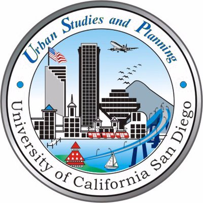

<em>"Links to disclosable code, presentations, and deliverables are available on my LinkedIn profile"</em>

 

 
  
  
<strong> Applied AI & Jr. Software Developer <em>(Cognitive City Twins)</em>
  &nbsp;&nbsp;&nbsp;&nbsp;&nbsp;&nbsp;
  Jan 2024 - Present</strong><em> La Jolla, California
  &nbsp;&nbsp;&nbsp;&nbsp;&nbsp;&nbsp;&nbsp;&nbsp;&nbsp;&nbsp;&nbsp;&nbsp;&nbsp;&nbsp;&nbsp;&nbsp;&nbsp;&nbsp;&nbsp;&nbsp;&nbsp;&nbsp;&nbsp;&nbsp;&nbsp;&nbsp;&nbsp;&nbsp;&nbsp;&nbsp;&nbsp;&nbsp;&nbsp;&nbsp;&nbsp;&nbsp;&nbsp;&nbsp;&nbsp;&nbsp;&nbsp;&nbsp;&nbsp;&nbsp;&nbsp;&nbsp;&nbsp;&nbsp;&nbsp;&nbsp;&nbsp;&nbsp;&nbsp;&nbsp;&nbsp;&nbsp;&nbsp;&nbsp;&nbsp;&nbsp;&nbsp;&nbsp;&nbsp;&nbsp;&nbsp;&nbsp;&nbsp;&nbsp;&nbsp;&nbsp;&nbsp;&nbsp;&nbsp;&nbsp;&nbsp;&nbsp;&nbsp;&nbsp;&nbsp;&nbsp;&nbsp;&nbsp;&nbsp;&nbsp;&nbsp;&nbsp;&nbsp;&nbsp;&nbsp;&nbsp;&nbsp;&nbsp;&nbsp;
  Part-time</em>

Organization website: [Qualcomm Institute](https://qi.ucsd.edu/)

- Implemented scalable data integration workflows using blueprints and structs in Unreal Engine 5
- Developed data viz apps using UE5 objects/instanced static meshes with dynamic spawning, scaling, georeferencing
- Implemented Cesium cartographic polygons, raster overlays, and color blending across material layers for tile coloring
- Integrated Google Maps API for a realistic global world as the base for visualization needs in real estate and urban planning
- Utilized Datasmith Exporter plugin to integrate Cesium in Unreal Engine with SketchUp Pro for property modeling
- Built interactive, 3D widgets to display property/urban data, emphasizing user experience and future VR integration
- Developed a framework for building digital twins of buildings in the real world for future placement in the city twins
- Aggregated a large database of the San Diego-Carlsbad region data for future visualization in the cognitive city twins

 

 
  
  
<strong> President & Lead Data Scientist
  &nbsp;&nbsp;&nbsp;&nbsp;&nbsp;&nbsp;&nbsp;&nbsp;&nbsp;&nbsp;&nbsp;&nbsp;&nbsp;&nbsp;&nbsp;&nbsp;&nbsp;&nbsp;&nbsp;&nbsp;&nbsp;&nbsp;&nbsp;&nbsp;&nbsp;&nbsp;&nbsp;&nbsp;&nbsp;&nbsp;&nbsp;&nbsp;&nbsp;&nbsp;&nbsp;&nbsp;&nbsp;&nbsp;&nbsp;&nbsp;&nbsp;&nbsp;&nbsp;&nbsp;&nbsp;&nbsp;&nbsp;&nbsp;&nbsp;&nbsp;&nbsp;
  Sep 2022 - Present</strong><em> La Jolla, California
  &nbsp;&nbsp;&nbsp;&nbsp;&nbsp;&nbsp;&nbsp;&nbsp;&nbsp;&nbsp;&nbsp;&nbsp;&nbsp;&nbsp;&nbsp;&nbsp;&nbsp;&nbsp;&nbsp;&nbsp;&nbsp;&nbsp;&nbsp;&nbsp;&nbsp;&nbsp;&nbsp;&nbsp;&nbsp;&nbsp;&nbsp;&nbsp;&nbsp;&nbsp;&nbsp;&nbsp;&nbsp;&nbsp;&nbsp;&nbsp;&nbsp;&nbsp;&nbsp;&nbsp;&nbsp;&nbsp;&nbsp;&nbsp;&nbsp;&nbsp;&nbsp;&nbsp;&nbsp;&nbsp;&nbsp;&nbsp;&nbsp;&nbsp;&nbsp;&nbsp;&nbsp;&nbsp;&nbsp;&nbsp;&nbsp;&nbsp;&nbsp;&nbsp;&nbsp;&nbsp;&nbsp;&nbsp;&nbsp;&nbsp;&nbsp;&nbsp;&nbsp;&nbsp;&nbsp;&nbsp;&nbsp;&nbsp;&nbsp;&nbsp;&nbsp;&nbsp;&nbsp;&nbsp;&nbsp;&nbsp;&nbsp;&nbsp;&nbsp;
  Part-time</em>

Organization website: [Biokind Analytics](https://www.biokind.org/)

- Manage organizational leadership, budget, marketing, outreach, public relations, and recruitment activities
- Worked with local healthcare non-profits in San Diego on potential avenues for data science to improve operations. Targeting ways to help clients improve efficiency, impact, outreach, client satisfaction, ROI, data systems/use case designs
- Oversee and participate in student data science projects to ensure quality, timely delivery, and meeting clients' expectations while upkeeping self; facilitating opportunities for students to apply academic training in impactful, real-world scenarios
- Organize correspondence between members, university faculty, department advisors, and non-profit representatives
- Analyzed large, archived and operational datasets to identify key metrics and actionable insights, leading to improved client understanding of programs, initiatives, grants performance; furthered clients’ mission as data-driven organizations
- Over $140 million in combined financial analyses performed, ranging from donations to research grants and charity events
- Derived ground-truth insights to clients’ operation with statistical inference, reflected clients’ past operation, checked recent business decisions, and inform future decisions. Performed feature selection/engineering for informative attributes
- Specialize in geo-/demographic, financial, operational & business strategies analyses, dashboarding, turning data into action

 

 
  
  
<strong> Housing Solutions Consultant & Designer in Residence
  &nbsp;&nbsp;&nbsp;&nbsp;&nbsp;&nbsp;&nbsp;&nbsp;
  Jan 2024 - June 2024</strong><em> San Diego, California
  &nbsp;&nbsp;&nbsp;&nbsp;&nbsp;&nbsp;&nbsp;&nbsp;&nbsp;&nbsp;&nbsp;&nbsp;&nbsp;&nbsp;&nbsp;&nbsp;&nbsp;&nbsp;&nbsp;&nbsp;&nbsp;&nbsp;&nbsp;&nbsp;&nbsp;&nbsp;&nbsp;&nbsp;&nbsp;&nbsp;&nbsp;&nbsp;&nbsp;&nbsp;&nbsp;&nbsp;&nbsp;&nbsp;&nbsp;&nbsp;&nbsp;&nbsp;&nbsp;&nbsp;&nbsp;&nbsp;&nbsp;&nbsp;&nbsp;&nbsp;&nbsp;&nbsp;&nbsp;&nbsp;&nbsp;&nbsp;&nbsp;&nbsp;&nbsp;&nbsp;&nbsp;&nbsp;&nbsp;&nbsp;&nbsp;&nbsp;&nbsp;&nbsp;&nbsp;&nbsp;&nbsp;&nbsp;&nbsp;&nbsp;&nbsp;&nbsp;&nbsp;&nbsp;&nbsp;&nbsp;&nbsp;&nbsp;&nbsp;&nbsp;&nbsp;&nbsp;&nbsp;&nbsp;&nbsp;
  Part-time</em>

Organization website: [WDC](https://wdc2024.org/)

- Advised the ADUGenius project on ADUs as an innovative housing solution, covering financing structures, tax benefits, saving strategies (straight-line, cost segmented depreciation), building costs, ordinance adoption, setbacks, myths, designs, sustainability, and useful policies/programs
- Served a secretary role in meetings and correspondence between stakeholders from the United States, Mexico, the UC San Diego Design Lab, and impact project leads to assist San Diego-Tijuana international collaboration projects
- Performed administrative duties for the Science & Tech Network, including event coordination, media design, monthly 
updates to the World Design Capital committee, event MC/moderator at events with community members & project leads

 

 
  
  
<strong> Fellow Scholar
  &nbsp;&nbsp;&nbsp;&nbsp;&nbsp;&nbsp;&nbsp;&nbsp;&nbsp;&nbsp;&nbsp;&nbsp;&nbsp;&nbsp;&nbsp;&nbsp;&nbsp;&nbsp;&nbsp;&nbsp;&nbsp;&nbsp;&nbsp;&nbsp;&nbsp;&nbsp;&nbsp;&nbsp;&nbsp;&nbsp;&nbsp;&nbsp;&nbsp;&nbsp;&nbsp;&nbsp;&nbsp;&nbsp;&nbsp;&nbsp;&nbsp;&nbsp;&nbsp;&nbsp;&nbsp;&nbsp;&nbsp;&nbsp;&nbsp;&nbsp;&nbsp;&nbsp;&nbsp;&nbsp;&nbsp;&nbsp;&nbsp;&nbsp;&nbsp;&nbsp;&nbsp;&nbsp;&nbsp;&nbsp;&nbsp;&nbsp;&nbsp;&nbsp;&nbsp;&nbsp;&nbsp;&nbsp;&nbsp;&nbsp;&nbsp;&nbsp;&nbsp;&nbsp;
  Sep 2023 - Present</strong><em> La Jolla, California
  &nbsp;&nbsp;&nbsp;&nbsp;&nbsp;&nbsp;&nbsp;&nbsp;&nbsp;&nbsp;&nbsp;&nbsp;&nbsp;&nbsp;&nbsp;&nbsp;&nbsp;&nbsp;&nbsp;&nbsp;&nbsp;&nbsp;&nbsp;&nbsp;&nbsp;&nbsp;&nbsp;&nbsp;&nbsp;&nbsp;&nbsp;&nbsp;&nbsp;&nbsp;&nbsp;&nbsp;&nbsp;&nbsp;&nbsp;&nbsp;&nbsp;&nbsp;&nbsp;&nbsp;&nbsp;&nbsp;&nbsp;&nbsp;&nbsp;&nbsp;&nbsp;&nbsp;&nbsp;&nbsp;&nbsp;&nbsp;&nbsp;&nbsp;&nbsp;&nbsp;&nbsp;&nbsp;&nbsp;&nbsp;&nbsp;&nbsp;&nbsp;&nbsp;&nbsp;&nbsp;&nbsp;&nbsp;&nbsp;&nbsp;&nbsp;&nbsp;&nbsp;&nbsp;&nbsp;&nbsp;&nbsp;&nbsp;&nbsp;&nbsp;&nbsp;&nbsp;&nbsp;&nbsp;&nbsp;
  Fellowship</em>

Real Estate + Data Science experiential learning fellowship with the Urban Studies & Planning Department and Homelessness Hub at UC San Diego, under the ULI H2H Mission Priority Initiative.

<b>Affordable Housing Research Assistant</b>

Mentors: [Dr. Feiyang Sun](https://usp.ucsd.edu/people/faculty/profiles/sun-feiyang.html), [Dr. Mirle Rabinowitz-Bussell](https://usp.ucsd.edu/people/faculty/profiles/rabinowitz-bussell.html)
 
- Reported affordable housing policy incentives and cost factors, emphasizing public improvements and tax incentives
- Networked with industry professionals to study affordable housing market feasibility, focused on LIHTC and ADUs
- Received sponsorship to network with SDGBC to study green building techniques and integration with affordable housing

<b>Data Science Fellow</b>

- Programmed a bespoke algorithm to parse property data from CoStar into a tabular format for non-commercial purposes
- Applied statistics and machine learning on over 5000 LIHTC projects to derive factors influencing fund allocation
- Utilized analysis methods for social science: feature engineering, clustering, attribute stratification, marginal error analysis

 

 
  
  
<strong> Data Science Trainee in Niema Lab
  &nbsp;&nbsp;&nbsp;&nbsp;&nbsp;&nbsp;&nbsp;&nbsp;&nbsp;&nbsp;&nbsp;&nbsp;&nbsp;&nbsp;&nbsp;&nbsp;&nbsp;&nbsp;&nbsp;&nbsp;&nbsp;&nbsp;&nbsp;&nbsp;&nbsp;&nbsp;&nbsp;&nbsp;&nbsp;&nbsp;&nbsp;&nbsp;&nbsp;&nbsp;&nbsp;&nbsp;&nbsp;&nbsp;&nbsp;&nbsp;&nbsp;
  Sep 2022 - Oct 2023</strong><em> La Jolla, California
  &nbsp;&nbsp;&nbsp;&nbsp;&nbsp;&nbsp;&nbsp;&nbsp;&nbsp;&nbsp;&nbsp;&nbsp;&nbsp;&nbsp;&nbsp;&nbsp;&nbsp;&nbsp;&nbsp;&nbsp;&nbsp;&nbsp;&nbsp;&nbsp;&nbsp;&nbsp;&nbsp;&nbsp;&nbsp;&nbsp;&nbsp;&nbsp;&nbsp;&nbsp;&nbsp;&nbsp;&nbsp;&nbsp;&nbsp;&nbsp;&nbsp;&nbsp;&nbsp;&nbsp;&nbsp;&nbsp;&nbsp;&nbsp;&nbsp;&nbsp;&nbsp;&nbsp;&nbsp;&nbsp;&nbsp;&nbsp;&nbsp;&nbsp;&nbsp;&nbsp;&nbsp;&nbsp;&nbsp;&nbsp;&nbsp;&nbsp;&nbsp;&nbsp;&nbsp;&nbsp;&nbsp;&nbsp;&nbsp;&nbsp;&nbsp;&nbsp;&nbsp;&nbsp;&nbsp;&nbsp;&nbsp;&nbsp;&nbsp;&nbsp;&nbsp;&nbsp;&nbsp;&nbsp;&nbsp;
  Fellowship</em>

Data science experiential learning fellowship with the Computer Science & Engineering department

Mentor: [Dr. Niema Moshiri](http://niema.net/)

- Developed an interactive application to visualize Covid-19 time-series data with variant segmentation
- Programmed a bespoke data-smoothing algorithm that selectively reads data upon user requests to optimize runtime
- Reduced initial runtime by 97% (5s to sub-0.1s) with caching/memoization and efficient data structure implementation
- Benchmarked data compression techniques to optimize serialization efficiency and expedite loading speed
- Wrote 7 research notebooks to uncover patterns in 30+ large-scale datasets involving 3000+ cancer patients
- Exceeded 87% accuracy across diverse evaluation metrics, in accurately predicting breast cancer recurrence status
- Analyzed disparities and data collection gaps to ensure ethical and responsible data science practices
- Honored with a nomination by Dr. Moshiri to deliver a presentation at UCSD’s 36th Annual Undergrad Research Conference
- Special commendation post by the Semiconductor Research Corporation on LinkedIn

 

 
  
  
<strong> Lead Data Analyst Intern
  &nbsp;&nbsp;&nbsp;&nbsp;&nbsp;&nbsp;&nbsp;&nbsp;&nbsp;&nbsp;&nbsp;&nbsp;&nbsp;&nbsp;&nbsp;&nbsp;&nbsp;&nbsp;&nbsp;&nbsp;&nbsp;&nbsp;&nbsp;&nbsp;&nbsp;&nbsp;&nbsp;&nbsp;&nbsp;&nbsp;&nbsp;&nbsp;&nbsp;&nbsp;&nbsp;&nbsp;&nbsp;&nbsp;&nbsp;&nbsp;&nbsp;&nbsp;&nbsp;&nbsp;&nbsp;&nbsp;&nbsp;&nbsp;&nbsp;&nbsp;&nbsp;&nbsp;&nbsp;&nbsp;&nbsp;&nbsp;&nbsp;&nbsp;&nbsp;
  Jun 2022 - Aug 2022</strong><em> City of Johannesburg, Gauteng, South Africa (Remote)
  &nbsp;&nbsp;&nbsp;&nbsp;&nbsp;&nbsp;&nbsp;&nbsp;&nbsp;&nbsp;&nbsp;&nbsp;&nbsp;&nbsp;&nbsp;&nbsp;&nbsp;&nbsp;&nbsp;&nbsp;&nbsp;&nbsp;&nbsp;&nbsp;&nbsp;&nbsp;&nbsp;&nbsp;&nbsp;&nbsp;&nbsp;&nbsp;&nbsp;&nbsp;&nbsp;&nbsp;&nbsp;
  Internship</em>

Company website: [Going Solo IT Services & IT Consulting](https://goingsolo.com/)

- Implemented a character-based word embeddings model (char2vec) based on a recurrent neural network using Keras from TensorFlow, coupled with Scikit-learn for linear dimensionality reduction of vectors
- Streamlined data labeling processes through the implementation of an automated Bayesian classifier, significantly improving efficiency
- Leveraged API calls to query data from findl.com, allowing seamless access to essential information for analysis
- Conducted comprehensive analysis of an S&P 500 company's stock/financials and transformed insights into an interactive dashboard using Tableau, facilitating intuitive visualization and exploration of key metrics
- Demonstrated exceptional organizational skills by successfully coordinating projects and effectively managing team communication across 7+ time zones, ensuring smooth collaboration and timely delivery
- Enhanced project management practices by refining and maintaining a dynamic PM dashboard in Google Sheets, enabling real-time progress tracking and streamlined reporting to supervisors

Exceeded internship expectations by proactively implementing an automated data labeling tool by leveraging machine learning, effectively saving significant time and resources when the initial assigned approach was brute force, setting a new standard for efficiency and problem-solving at the company

 

 
  
  
<strong> Deloitte Data Science Mentorship Program Mentee
  &nbsp;&nbsp;&nbsp;&nbsp;&nbsp;&nbsp;&nbsp;&nbsp;&nbsp;&nbsp;&nbsp;&nbsp;&nbsp;&nbsp;
  Feb 2022 - May 2022</strong><em> San Diego, California
  &nbsp;&nbsp;&nbsp;&nbsp;&nbsp;&nbsp;&nbsp;&nbsp;&nbsp;&nbsp;&nbsp;&nbsp;&nbsp;&nbsp;&nbsp;&nbsp;&nbsp;&nbsp;&nbsp;&nbsp;&nbsp;&nbsp;&nbsp;&nbsp;&nbsp;&nbsp;&nbsp;&nbsp;&nbsp;&nbsp;&nbsp;&nbsp;&nbsp;&nbsp;&nbsp;&nbsp;&nbsp;&nbsp;&nbsp;&nbsp;&nbsp;&nbsp;&nbsp;&nbsp;&nbsp;&nbsp;&nbsp;&nbsp;&nbsp;&nbsp;&nbsp;&nbsp;&nbsp;&nbsp;&nbsp;&nbsp;&nbsp;&nbsp;&nbsp;&nbsp;&nbsp;&nbsp;&nbsp;&nbsp;&nbsp;&nbsp;&nbsp;&nbsp;
  Development Program</em>

Company website: [Deloitte Business Consulting & Services](https://www2.deloitte.com/global/en/services/consulting-deloitte.html)

A data science mentorship program jointly organized by Deloitte and the Halicioglu Data Science Institute

- Utilized ARIMA models to generate employment metric forecasts and predict market behaviors due to Covid-19
- Conducted in-depth analysis to extract actionable insights uding multiple linear regression, exploratory data analysis (EDA), and visualization
- Collaborated closely with a dedicated mentor from Deloitte, receiving personalized guidance and support on a weekly basis
- Presented findings to an audience of Deloitte practitioners and advisors from the Halicioglu Data Science Institute

Assumed a leadership position within the project group, taking charge of task assignments, scheduling meetings, and cultivating a cohesive project story when our team needed leadership; fostering a positive, motivated team environment, on-time delivery, and quality assurance.

 

 
  
  
<strong> UCSD CSE SPIS Student
  &nbsp;&nbsp;&nbsp;&nbsp;&nbsp;&nbsp;&nbsp;&nbsp;&nbsp;&nbsp;&nbsp;&nbsp;&nbsp;&nbsp;&nbsp;&nbsp;&nbsp;&nbsp;&nbsp;&nbsp;&nbsp;&nbsp;&nbsp;&nbsp;&nbsp;&nbsp;&nbsp;&nbsp;&nbsp;&nbsp;&nbsp;&nbsp;&nbsp;&nbsp;&nbsp;&nbsp;&nbsp;&nbsp;&nbsp;&nbsp;&nbsp;&nbsp;&nbsp;&nbsp;&nbsp;&nbsp;&nbsp;&nbsp;&nbsp;&nbsp;&nbsp;&nbsp;&nbsp;&nbsp;&nbsp;&nbsp;&nbsp;&nbsp;&nbsp;&nbsp;&nbsp;&nbsp;
  Aug 2021 - Sep 2021</strong><em> San Diego, California
  &nbsp;&nbsp;&nbsp;&nbsp;&nbsp;&nbsp;&nbsp;&nbsp;&nbsp;&nbsp;&nbsp;&nbsp;&nbsp;&nbsp;&nbsp;&nbsp;&nbsp;&nbsp;&nbsp;&nbsp;&nbsp;&nbsp;&nbsp;&nbsp;&nbsp;&nbsp;&nbsp;&nbsp;&nbsp;&nbsp;&nbsp;&nbsp;&nbsp;&nbsp;&nbsp;&nbsp;&nbsp;&nbsp;&nbsp;&nbsp;&nbsp;&nbsp;&nbsp;&nbsp;&nbsp;&nbsp;&nbsp;&nbsp;&nbsp;&nbsp;&nbsp;&nbsp;&nbsp;&nbsp;&nbsp;&nbsp;&nbsp;&nbsp;&nbsp;&nbsp;&nbsp;&nbsp;&nbsp;&nbsp;&nbsp;&nbsp;&nbsp;&nbsp;
  Development Program</em>

Program website: [SPIS - Summer Program for Incoming Students](http://spis.ucsd.edu/)

Pre-college summer computer science program

- Final Project: A web-app that generates vehicle suggestions given a user's lifestyle following a decision tree
- Programmed in Python and HTML for brower display of user interface

Typed my first print(“Hello World”). Had zero clue what machine learning was, so I implemented a purely if-else decision tree to build a car recommender. Did manage to use Flask for front end display!

 

 
  
  
<strong> SCHS Swim Team Manager and Swimmer
  &nbsp;&nbsp;&nbsp;&nbsp;&nbsp;&nbsp;&nbsp;&nbsp;&nbsp;&nbsp;&nbsp;&nbsp;&nbsp;&nbsp;&nbsp;&nbsp;&nbsp;&nbsp;&nbsp;&nbsp;&nbsp;&nbsp;&nbsp;&nbsp;&nbsp;&nbsp;&nbsp;&nbsp;&nbsp;&nbsp;&nbsp;&nbsp;
  Feb 2018 - Jun 2021</strong><em> San Jose, California
  &nbsp;&nbsp;&nbsp;&nbsp;&nbsp;&nbsp;&nbsp;&nbsp;&nbsp;&nbsp;&nbsp;&nbsp;&nbsp;&nbsp;&nbsp;&nbsp;&nbsp;&nbsp;&nbsp;&nbsp;&nbsp;&nbsp;&nbsp;&nbsp;&nbsp;&nbsp;&nbsp;&nbsp;&nbsp;&nbsp;&nbsp;&nbsp;&nbsp;&nbsp;&nbsp;
  Team Manager (2021), Swimmer (2017-2021)</em>

 

I volunteered to be my swim team’s manager (and swimmer) during my senior year in high school when we needed one

- Responsible for acquiring, storing, and presenting athletes' race times and lap time splits
- Hardware facet: scoreboard operation, backup timers preparation, starter/speaker system setup
- Software facet: Excel data entry (styling must follow SCHS’s practices and in formats readable by sports software), Hy-Tek meet manager software operation
- Systems used: Colorado System 6 Sports Timing System and Hy-Tek meet manager

<em>Notable accomplishments:</em> 2018 JV Coach's Award, 2019 JV Valuable Swimmer Award, 2021 Varsity Swim Appreciation Award, 2021 Varsity Coaches Choice Award

Fun fact: 4 awards given by 4 different coaches over 4 years
