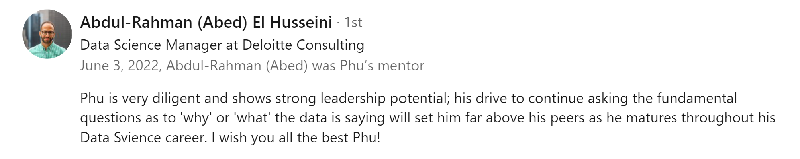
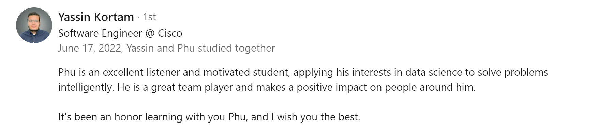

 

My letter of recommendation from Professor Todd Weaver, CPM, CCIM (go [here](https://drive.google.com/file/d/1jKlIcdm5blH7EE1fWUpOU0XU034V6oBJ/view?usp=sharing) for mobile view)

<embed src="assets/PhuDang_LetterofRec_ProfWeaver.pdf" type="application/pdf" width="100%" height="820">

 

Comments from Dr. Niema Moshiri on my fellowship work with UCSD Computer Science & Engineering (go [here](https://drive.google.com/file/d/1Wj__fg3FFlQjLUkPioXLi5evpuHncdpz/view?usp=sharing) for mobile view)

<embed src="assets/ProfessorMoshiriFeedback.pdf" type="application/pdf" width="100%" height="820">

 

My letter of recommendation from Mr. Joseph Sandate, AP Statistics (go [here](https://drive.google.com/file/d/1MkOKMzoI3Zzy7_3-SQgnSSJVW69tfBwg/view?usp=sharing) for mobile view)

<embed src="assets/PhuDang_LetterofRec_MrSandate.pdf" type="application/pdf" width="100%" height="820">